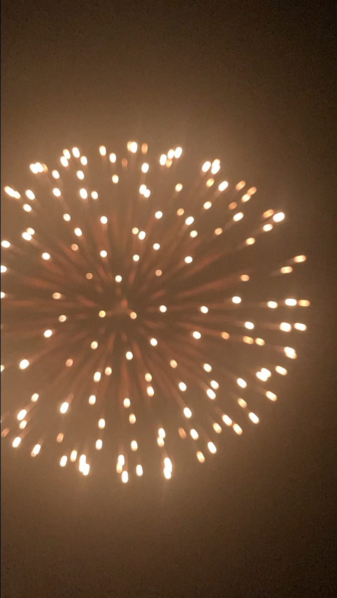
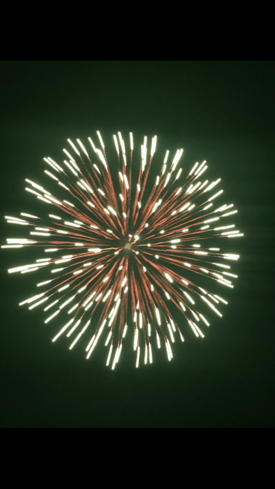
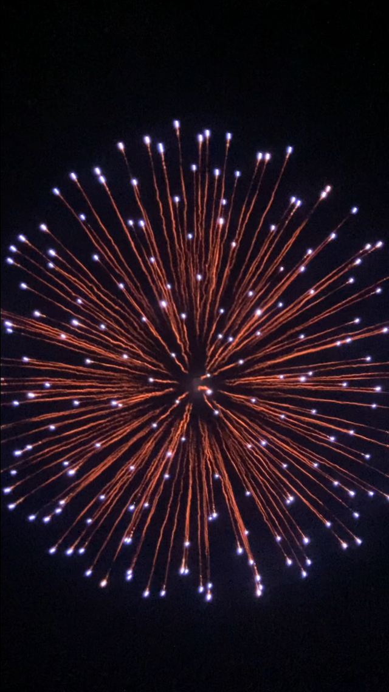
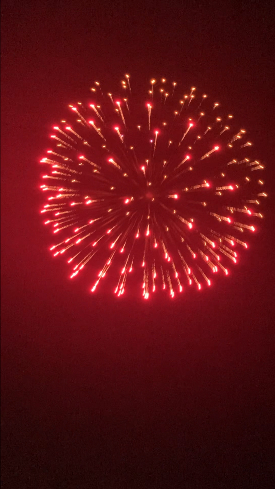

> <iframe width="700" height="360" src="https://adventar.org/calendars/12393/embed" frameborder="0"></iframe>
>
> この記事は [電通大プログラミング教室 Advent Calender 2025](https://adventar.org/calendars/12393) の3日目の記事です。

## はじめに
こんにちは、willといいます。

上の画像は、今年打ち上げた4号玉花火です。

この記事ではなんで花火を打ち上げたのか、どのように打ち上げたのかを話しています。  

## なんで花火を打ち上げた？
サークルの伝統です。

私が所属しているサークルでは20年以上前から花火を打ち上げています。

今でも続いていて、毎年の夏合宿で4号玉花火を計5発、打ち上げます。

普段の活動はごく普通の技術系サークルなのに、不思議な伝統です。

## どうやって打ち上げた？
花火は **金属製の筒に導火線を繋いだ煙火玉を入れ、遠隔で着火** して打ち上げます。

まず、筒の固定方法は大きく次の2つです。

- 筒を地面の上で倒れないようにする  
- 筒を地面に埋める  

今回は **地面に埋めて固定する方法** を採用しています。

理由はもしも筒の中で煙火玉が爆発した際に、周囲の土が緩衝材となって威力が減衰するからです。

また、安全のために以下の準備も行いました。

- 煙火消費従事者を配置する
- 役所や消防署への打ち上げ申請  
- 危険区域に人が入らないように防止線を設置  

## 大まかなスケジュール

| 月 | 内容 |
|----|------|
| 4月 | 講習を受けて**煙火消費従事者手帳**を取得 |
| 7月 | 花火を発注する |
| 8月 | 打ち上げ場所の下見、役所と消防署に届け出を提出 |
| 9月 | 打ち上げ |

:::note[煙火消費従事者手帳 とは]
日本煙火協会が発行する、**煙火の直接点火ができる資格**。執筆にあたり[ウィキペディア](https://ja.wikipedia.org/wiki/%E7%85%99%E7%81%AB%E6%B6%88%E8%B2%BB%E4%BF%9D%E5%AE%89%E6%89%8B%E5%B8%B3)で知ったが、現在では一般的に取得することは難しいらしい。
:::

## 打ち上げ当日の作業風景

打ち上げ日は、前述したように筒を固定するための穴を掘ります。

また、枯れ草に火の粉が落ちてぼやになることを防ぐために、打ち上げ場所周辺の草を刈ります。

これがとても大変な作業で、終わった頃には日が沈んでいました...

部員全員で交代しながら頑張りました。

## 打ち上げの様子
打ち上げ時間は風もなく、真上に飛んでいきました。

## 補足

打ち上げた瞬間の画像です。こっちの方が迫力が伝わるかもしれないですね。

## おわりに
花火は見て楽しむのも実際に打ち上げるのもとても楽しいです！

もし来年、どこで花火が打ち上がっているのを見つけたら、それは私たちのサークルかもしれません。

最後までお読みいただきありがとうございました。

